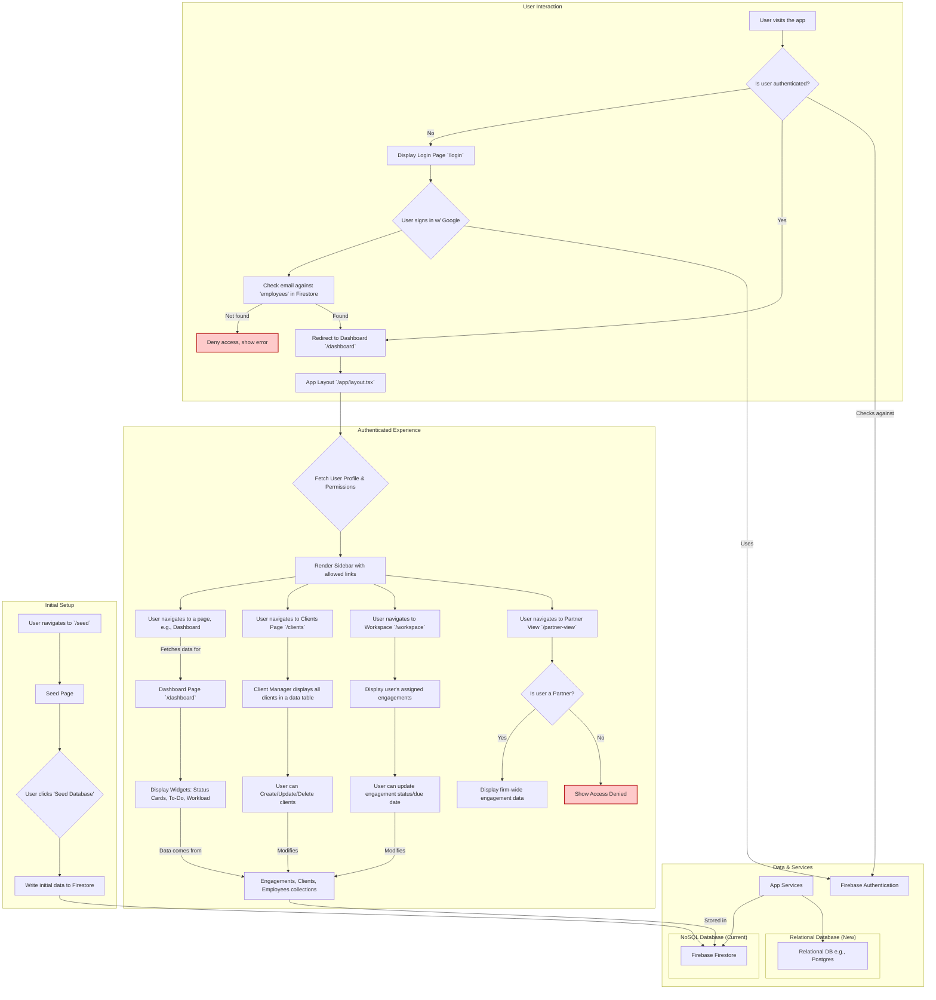

# DMV Central Application Architecture

This document outlines the high-level architecture and data flow of the DMV Central application.

## Logic Flowchart

## Key Concepts

1.  **Authentication**: Handled via Firebase Authentication (Google Sign-In). Access is restricted to users whose email exists in the `employees` collection in Firestore.
2.  **Authorization**: Feature access is controlled by a permissions system. The `app-layout-client` fetches the current user's department/role and checks it against the `permissions` collection in Firestore to determine which navigation links to show.
3.  **Data Fetching**: Most pages are client-side rendered (`"use client";`). They use `useEffect` hooks and Firebase's `onSnapshot` listener to get real-time data from Firestore. This makes the UI reactive to database changes.
4.  **Component Structure**:
    *   **`/app`**: Contains the main page layouts and routing.
    *   **`/components`**: Contains reusable UI components, categorized by feature (e.g., `dashboard`, `client`, `workspace`) and the general `ui` library (ShadCN components).
    *   **`/lib`**: Holds utility functions (`utils.ts`), Firebase configuration (`firebase.ts`), and the core data type definitions (`data.ts`).
    *   **`/hooks`**: Contains custom React hooks, such as `useAuth` for authentication state and `useToast` for notifications.
5.  **State Management**: Local component state is managed with `useState` and `useReducer`. Global authentication state is managed via `useAuth` and React Context. Complex state related to tables or forms is handled by libraries like TanStack Table and React Hook Form.
